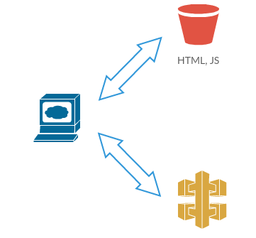

# LAB 1 - Creating IAM Role & S3 Bucket

## LAB Overview

#### This lab will demonstrate:
* Creating S3 bucket
* Creating IAM Roles for services
* Setting S3 bucket as website hosting 





## Task 1: Create an S3 bucket

In this task you will use an an S3 bucket to store data about your aplpications.

1. In the AWS Management Console, on the **Services** menu, click **S3**.
2. Click **Create bucket**.
3. Enter a bucket name, e.g. "Student-X-Bucket".
4. Click **Create**.


## Task 2: Copy applications definitions file to S3 bucket

In this task you'll upload a file to an S3 bucket.

1. Create or download  **[apps.json](apps.json)** file.
2. In the AWS Management Console, on the **Services** menu, click **S3**.
3. Find your bucket and click on its name.
4. Click **Upload**.
5. Click *Add files**.
6. Select your "apps.json" file and click **Upload**.


## Task 3: Create a role for Lambda function

You will create a role for your Lambda. The role lets Lambda use other AWS services.

1. In the AWS Management Console, on the **Services** menu, click **IAM**.
2. Click **Roles**.
3. Click **Create role**.
4. Select **AWS Service** and **Lambda**.
5. Click **Next: Permissions**.
6. Find "AmazonS3ReadOnlyAccess" policy and add it to the role by checking the checkbox on the left.
7. Find "AmazonDynamoDBFullAccess" policy and add it to the role by checking the checkbox on the left.
8. Click button above **Create policy** (new windows will open).
9. Click **JSON**.
10. Download  **[Lambda_simple_policy.json](Lambda_simple_policy.json)** file.
11. Delete everything from the console editor and paste the file into editor field.
12. Click **Review policy**.
13. Enter a name for your policy, e.g. "SimpleLambdaPolicy".
14. Click **Create policy**.
15. Back in the role editor (previous tab) click  button, enter the name of your previously created policy into "Filter policies" search field.
16. Find you policy and add it to the role by checking the checkbox on the left.
8. Click **Next: Tags**.
9. Click **Next: Review**.
10. Enter a name for your role, e.g. "Lambda1-Role".
11. Click **Create role**.

Please, look into the role policies. 

## Task 4: Deploying html and js files to S3 bucket

In this task you will use an an S3 bucket to store REACT web app.

1. In the AWS Management Console, on the **Services** menu, click **S3**.
2. Click **Create bucket**.
3. Enter a bucket name, e.g. "Student-X-WWW-Bucket".
4. Click **Create**.
5. Click on  your bucket bucket name.
6. Click **Properties** tab.
7. Click **Static website hosting** and select **Use this bucket to host a website**.
8. Enter *index.html* as **Index document** name.
9. Copy the **Endpoint** URL and paste into notes.
10. Click **Save**.
11. Click **Permissions** tab.
12. Click **Edit**, uncheck both **Block new public bucket policies (Recommended)** and **Block public and cross-account access if bucket has public policies (Recommended)**.
13. click **Save**, enter *confirm* when asked for and click **Confirm**.
14. Click **Bucket policy**.
15. Download [s3_www_bucket_policy.json](s3_www_bucket_policy.json) file.
16. Edit
```
"Resource": "arn:aws:s3:::<YOUR-BUCKET-NAME>/*" and
```
and enter your bucket name instead of 
```
<YOUR-BUCKET-NAME>
```

16. Paste the content of the file into **Bucket policy editor** and click **Save**.
17. Click **Overview** tab.
18. Download [website content](./www/www.zip), unzip it and upload all files to your S3 www bucket.
19. Check if your website is working fine by opening S3 website url (Endpoint copied in step 9.) in a browser.

## END LAB

<br><br>

